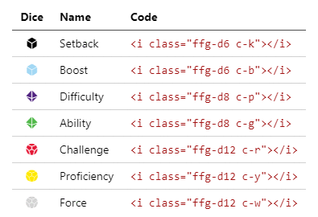
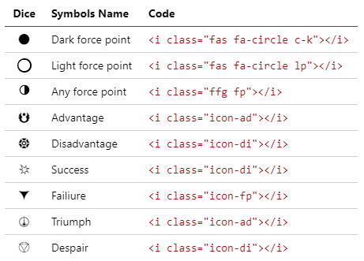

<link rel="stylesheet" type="text/css" href="./icons/css/icons.min.css"/>

# SW-FFG-Mardown
Simple boilerplate for MD file that could use the Star Wars FFG symbols.   
Simply _clone_ this repo or take the _release_ and start editing the _README.md_ file with any __Markdown__ editor.

## Dice

| Name | Code |
|:-----|:---|
| Setback | `<i class="fas fa-dice-d6 c-k"></i>` |
| Boost | `<i class="fas fa-dice-d6 c-k"></i>` |
| Difficulty | `<i class="fas fa-dice-d8 c-p"></i>` |
| Ability | `<i class="fas fa-dice-d8 c-g"></i>` |
| Challenge | `<i class="fas fa-dice-d12 c-r"></i>` |
| Proficiency | `<i class="fas fa-dice-d12 c-y"></i>` |
| Force | `<i class="fas fa-dice-d12 c-w"></i>` |

## Symbols

| Name | Code |
|:-----|:---|
| Dark force point | `<i class="fas fa-circle c-k"></i>` |
| Light force point | `<i class="fas fa-circle lp"></i>` |
| Any force point | `<i class="ffg fp"></i>` |
| Advantage | `<i class="icon-ad"></i>` |
| Disadvantage | `<i class="icon-di"></i>` |
| Success | `<i class="icon-di"></i>` |
| Failiure | `<i class="icon-fp"></i>` |
| Triumph | `<i class="icon-ad"></i>` |
| Despair | `<i class="icon-di"></i>` |

## Showreel

## Special thanks
Nymrodel -_Lord of vector_
